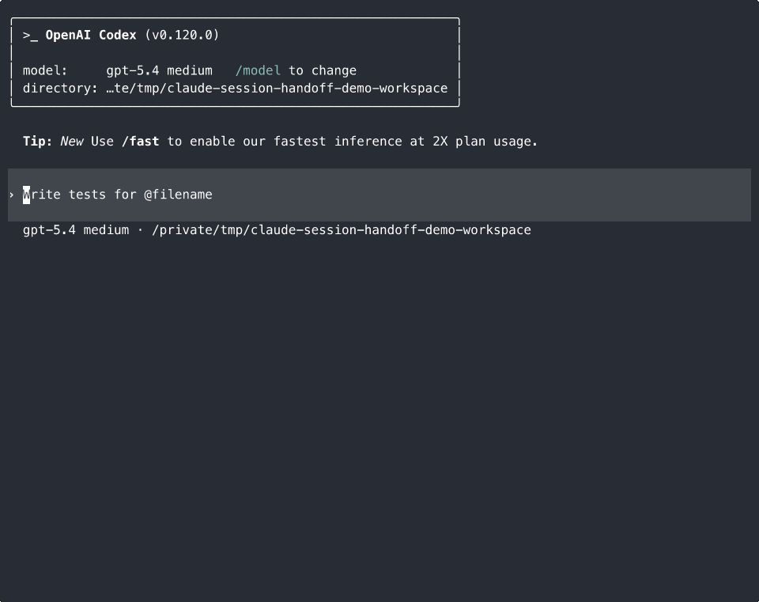

# claude-session-handoff

Recover a previous Claude Code session into a Codex handoff from local transcript files, without calling Claude in the normal path.

This is for the common failure mode where Claude Code hit a token limit, lost context, or the session ended, and you want Codex to continue from the local artifacts already on disk.



The repository now ships both:

- a bundled Codex skill inside the plugin package for direct skill installs
- a Codex plugin package for plugin-based installs and marketplace testing

## What it does

- Finds recent local Claude sessions
- Shows a short numbered picker instead of guessing
- Resolves your choice from a saved snapshot, so the picked number stays stable
- Summarizes the selected transcript into a compact Codex handoff
- Stops after the handoff so you can decide what happens next

## Why this exists

Claude Code can burn through token budget and session limits fast. When that happens, the practical need is simple: continue the work in Codex without manually reconstructing the whole thread from scratch.

The default recovery pattern is usually manual and messy: find the right transcript, inspect it, reconstruct intent, then restate the open thread to another agent. This skill makes that path deterministic and cheap.

- No Claude token usage in the normal flow
- No dependency on the `claude` CLI
- Works from transcript artifacts already on your machine

## Requirements

- Python 3.10+
- Codex CLI
- Local Claude session transcripts on disk

## Install

### Install as a Codex plugin

This is the preferred path if you want the plugin to show up in Codex's plugin flow.

From the repository root:

```bash
python3 scripts/install_plugin.py
```

If you prefer a copy instead of a symlink:

```bash
python3 scripts/install_plugin.py --mode copy
```

This installs the plugin into `~/plugins/claude-session-handoff` and adds it to your personal Codex marketplace at `~/.agents/plugins/marketplace.json`.

Then restart Codex and open `/plugins`.

If you invoke the bundled skill explicitly after plugin installation, Codex may show it in namespaced form:

- `$claude-session-handoff:claude-session-handoff`

### Install as a plain skill

From the repository root:

```bash
python3 scripts/install_skill.py
```

If you prefer a copy instead of a symlink:

```bash
python3 scripts/install_skill.py --mode copy
```

Then restart Codex.

Manual install targets:

- macOS/Linux: `~/.codex/skills/claude-session-handoff`
- Windows: `%USERPROFILE%\.codex\skills\claude-session-handoff`

## Use

After installation, prompts like these should trigger the skill:

- `Resume my last Claude session for this repo`
- `Recover a Claude Code session that ended and give me a handoff`
- `Find my last 5 Claude sessions and ask which one to resume`

Explicit invocation depends on how you installed it:

- plain skill install: `$claude-session-handoff`
- plugin install: `$claude-session-handoff:claude-session-handoff`
- natural-language prompts also work through implicit matching

Normal flow:

1. Discover recent local Claude sessions
2. Show a numbered picker
3. Summarize the selected session into a Codex handoff

## Plugin packaging

The plugin package lives at:

- `plugins/claude-session-handoff`

The installable skill that SkillsLLM and manual skill installs rely on lives at:

- `plugins/claude-session-handoff/skills/claude-session-handoff/SKILL.md`

For repo-local testing, this repository also includes:

- `.agents/plugins/marketplace.json`

That lets Codex surface the plugin when you open this repository locally. The current public Codex docs still describe the official global Plugin Directory publishing flow as coming soon, so the supported path today is local, personal, or repo marketplace installation.

## Verify your setup

macOS/Linux:

```bash
python3 scripts/doctor.py --cwd "$PWD"
```

Windows PowerShell:

```powershell
py -3 scripts/doctor.py --cwd (Get-Location)
```

The doctor reports:

- whether the skill is installed into Codex
- which Claude directories were checked
- how many transcript files were found

## Run the scripts directly

macOS/Linux:

```bash
python3 scripts/discover_sessions.py --cwd "$PWD" --limit 5 --picker
python3 scripts/discover_sessions.py --cwd "$PWD" --limit 5 --json --snapshot-out /tmp/claude-session-handoff-snapshot.json
python3 scripts/discover_sessions.py --snapshot-in /tmp/claude-session-handoff-snapshot.json --picker
python3 scripts/resolve_session_choice.py --snapshot /tmp/claude-session-handoff-snapshot.json --choice 1 --field file_path
python3 scripts/summarize_handoff.py --session /path/to/session.jsonl --json
```

Windows PowerShell:

```powershell
$snapshot = Join-Path $env:TEMP "claude-session-handoff-snapshot.json"
py -3 scripts/discover_sessions.py --cwd (Get-Location) --limit 5 --picker
py -3 scripts/discover_sessions.py --cwd (Get-Location) --limit 5 --json --snapshot-out $snapshot
py -3 scripts/discover_sessions.py --snapshot-in $snapshot --picker
py -3 scripts/resolve_session_choice.py --snapshot $snapshot --choice 1 --field file_path
py -3 scripts/summarize_handoff.py --session C:\path\to\session.jsonl --json
```

## How discovery works

Discovery checks these locations in order:

1. `--claude-projects-dir`
2. `CLAUDE_PROJECTS_DIR`
3. `CLAUDE_HOME/projects`
4. platform defaults in [references/storage-locations.md](references/storage-locations.md)

If your Claude data lives elsewhere, pass `--claude-projects-dir`.

## Privacy and limits

- The normal path reads local transcript files only.
- The skill recovers a handoff, not Claude's exact internal state.
- It is best-effort and depends on Claude transcript formats staying close to the JSONL structures covered by the tests.
- Session selection still happens through normal Codex chat replies because this is a plain skill, not a custom UI.

## Troubleshooting

If no sessions are found:

- run `scripts/doctor.py`
- confirm Claude transcript files exist locally
- pass `--claude-projects-dir` if Claude stores data outside the default path

If the wrong session is selected:

- run the discovery script directly and inspect the picker output
- invoke the skill from the repository you actually want to match

If a session file is missing or corrupted:

- malformed transcripts are skipped when possible
- direct `summarize_handoff.py` calls return a file-specific error

## Development

Run the test suite:

```bash
python3 -m unittest discover -s tests -v
```

Verify the packaged skill bundle matches the checked-in source files:

```bash
python3 scripts/verify_packaged_skill.py
```

The repository includes:

- `scripts/doctor.py` for local diagnostics
- `scripts/install_plugin.py` for personal plugin installation
- `.github/workflows/ci.yml` for cross-platform CI
- `agents/openai.yaml` for packaged skill metadata
- `plugins/claude-session-handoff/.codex-plugin/plugin.json` for Codex plugin packaging

## License

MIT
